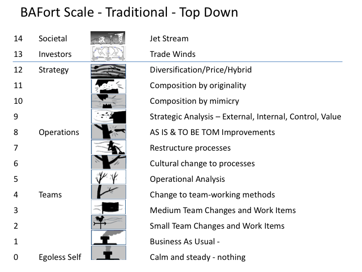

# BAFort
The BAFort scale complements the climate metaphor.

It started as a satirical swipe to show the time wasted by the hot air in Business Analysis meetings.

The critical thinking rang true for many people so it was developed a little further.

The chart below shows my default interpretation.

You can download the template if you want to make your own version