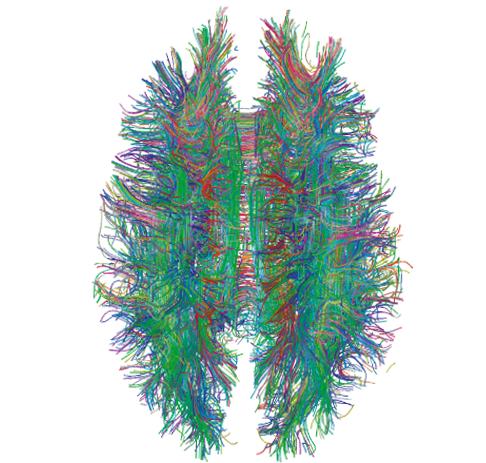
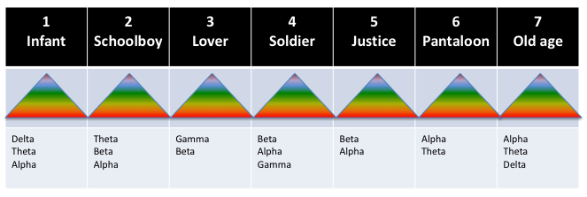

# Brain Model Surgery

Current ideas of how brains really operate and the models we use is changing rapidly.

The reptile, mammal, human model has been dropped as has the creative right/logical left.

The connectome, brain waves and polyvagalism are on trend.

That looks like a relatively complex set of interconnections.

We can use the above models to inform how we act at different stages in life.

