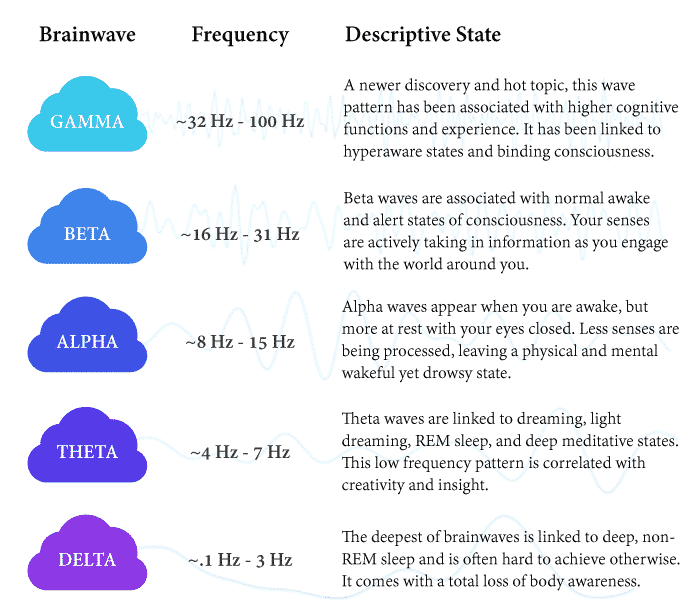
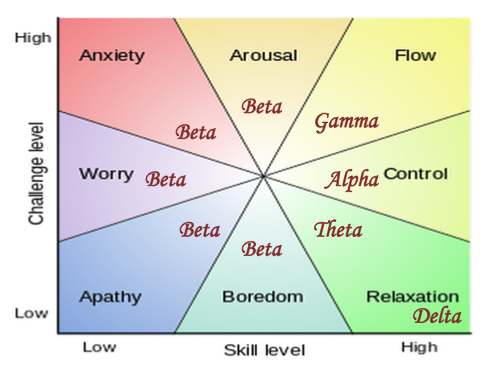

# Brain Waves

There are five brain waves that have so far been identified.

Each has a frequency and associated originating point in the brain.

They also relate to regions in Csikszentmihalyi's [1](#myfootnote1) FLOW model.

There is also the polyvagal theory that shows how gut-feel and intuition originate from our bodies. It is a scientific approach that appears to explain chakras.

There is a lot of research in this field. New discoveries are replacing the way we think of brain models. The 'reptile, mammal, human' and 'logical-left, creative-right' models have been shown to be wrong. What is now emerging is on point. It will inevitably change as new discoveries are made.

*** So What?

Being able to change modes at will is essential to future-proof careers and perhaps also offset early onset...

I use a variety of techniques:

1. Concentrate and block out other stuff. My wife thinks I have developed Asberger's
2. Looking at events through an aesthetic filter.
3. Music that modulates is a way of quickening thinking
4. Taking in a new painting and researching it is an easy way out
5. Some books or poetry can move me - but they are few and far between
6. I apply critical, creative and cognitive techniques from the library[2](#myfootnote2) and slot machine[3](#myfootnote3)

Mental flossing is as regular as brushing your teeth.

<a name="myfootnote1">1</a>: Mihaly Csikszentmihalyi <a href="https://en.wikipedia.org/wiki/Mihaly_Csikszentmihalyi" target="_blank">Flow</a>

<a name="myfootnote1">2</a>: Creative Thinking Techniques <a href="https://en.wikipedia.org/wiki/Mihaly_Csikszentmihalyi" target="_blank">Creative Techniques Library</a>

<a name="myfootnote1">3</a>: Critical, Creative and Cognitive aphorisms <a href="https:comscientia.com/blocs/slot-machine" target="_blank">Slot Machine</a>
