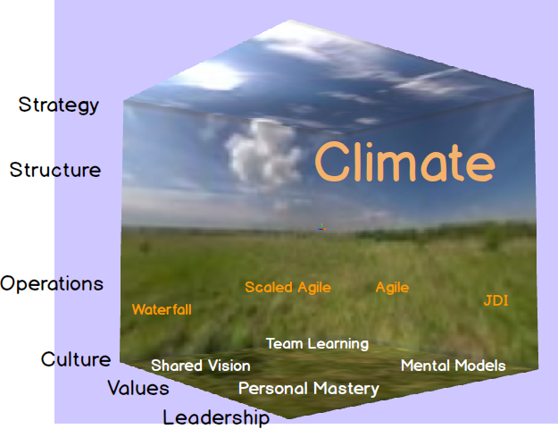

# Climate Change

Climate in an organisational context (corporate ecosystem) looks like this.

Strategy, structure and control are supported by culture, leadership and values.

The business is built on learning organisation foundations[1](#myfootnote1)

The business benefits of changing climate are engagement, enablement and empowerment at the appropriate levels. It should be easy for teams that self-organise.

As in the search for extra terrestrial planets that support life there is are similarities with climate for teams.

We introduce the model we use to measure team climate.

<!-- It can be instigated by any team on the BAFort scale[1](#myfootnote2). -->

#### Notes
<a name="myfootnote1">1</a>: <a href="https://www.scrum.org/resources/how-peter-senges-5-disciplines-learning-organizations-can-help-your-organization-be?gclid=Cj0KCQiApILhBRD1ARIsAOXWTzvfD8q_s1XRlKS_UIYorhnjfDl2am656SoW9g1FrJ7FIgaivsf5g70aAqD_EALw_wcB" target="_blank">Learning Organisation for agile</a>

<a name="myfootnote2">2</a>: [BAFort scale](./BAFort.md)</a>