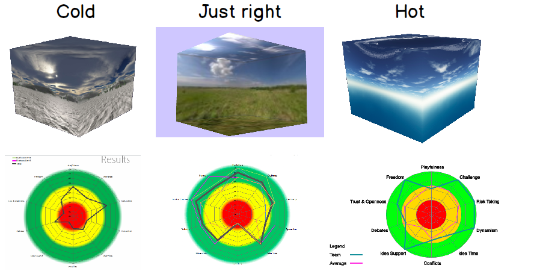

# Climate Change

Climate in an organisational context (corporate ecosystem) looks like the clouds.

Strategy, structure and control are supported by culture, leadership and values.

The processes are seen in the middle ground - between the horizon and the near ground.

Senge's four facets for systems thinking are like the crops in the near ground.

The business is built on learning organisation foundations[1](#myfootnote1)

The business benefits of changing climate are engagement, enablement and empowerment at the appropriate levels. It should be easy for teams that self-organise.

As in the search for extra terrestrial planets that support life (The Goldilocks Zone) there are similarities with climate for teams.

The radar charts represent Ekvall's model<a name="myfootnote3">3</a>: [BAFort scale](./BAFort.md)</a> we use to measure team climate. We measure 10 dimensions:

1. Playfulness
2. Challenge
3. Risk Taking
4. Dynamism
5. Idea Time
6. Conflicts
7. Idea Support
8. Debates
9. Trust and Openness
10. Freedom

<!-- It can be instigated by any team on the BAFort scale[1](#myfootnote2). -->

#### Notes
<a name="myfootnote1">1</a>: <a href="https://www.scrum.org/resources/how-peter-senges-5-disciplines-learning-organizations-can-help-your-organization-be?gclid=Cj0KCQiApILhBRD1ARIsAOXWTzvfD8q_s1XRlKS_UIYorhnjfDl2am656SoW9g1FrJ7FIgaivsf5g70aAqD_EALw_wcB" target="_blank">Learning Organisation for agile</a>

<a name="myfootnote2">2</a>: [BAFort scale](./BAFort.md)</a>

<a name="myfootnote2">3</a>: <a href="https://timeandemotion.com/downloads/Ekvall 1996.pdf" target="_blank">Ekvall's Model</a>