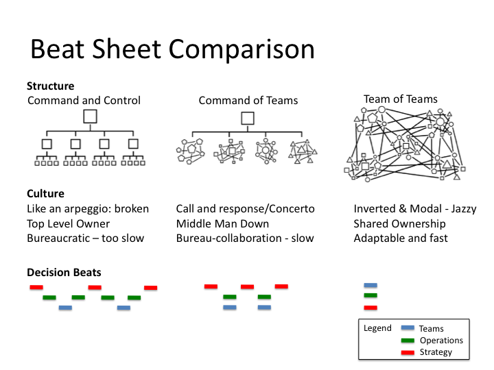

# Dramatic arcs

The time it takes to traverse the narrative arc is defined by the decision making process outlined in the beat sheets.

Beats are the pauses in dialogue or actions on plays.

Drama can be played out following several methods

1. Disney
2. Soap Opera
3. Life affirming

They can be shown as Boisot's clans, fiefs and bureaucracy