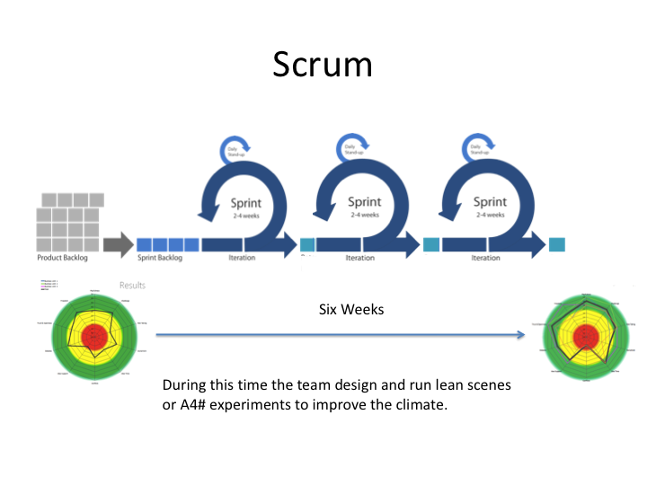
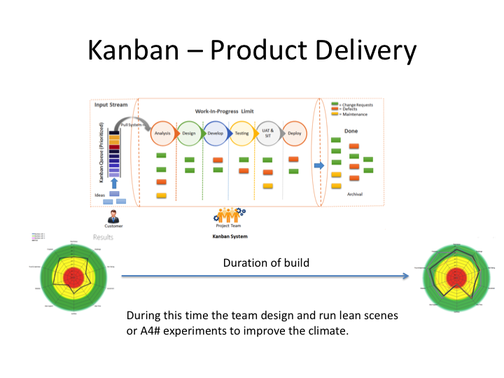
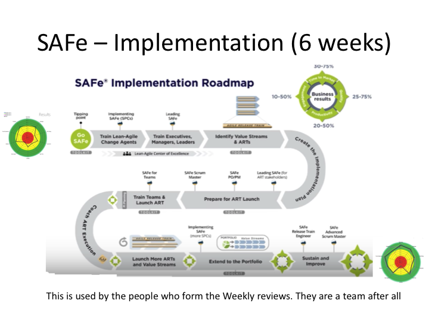
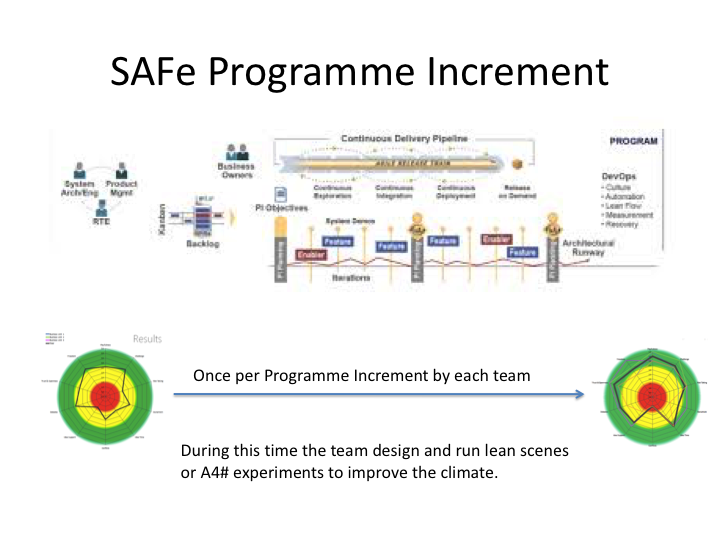
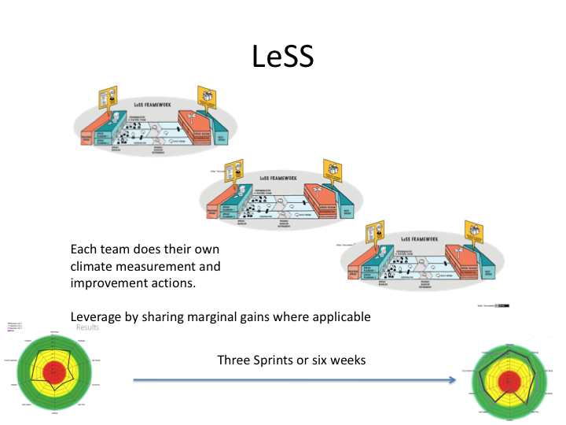
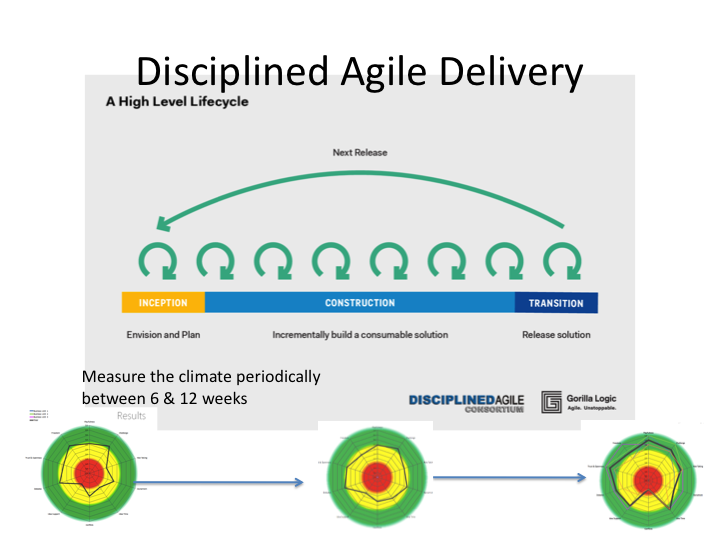
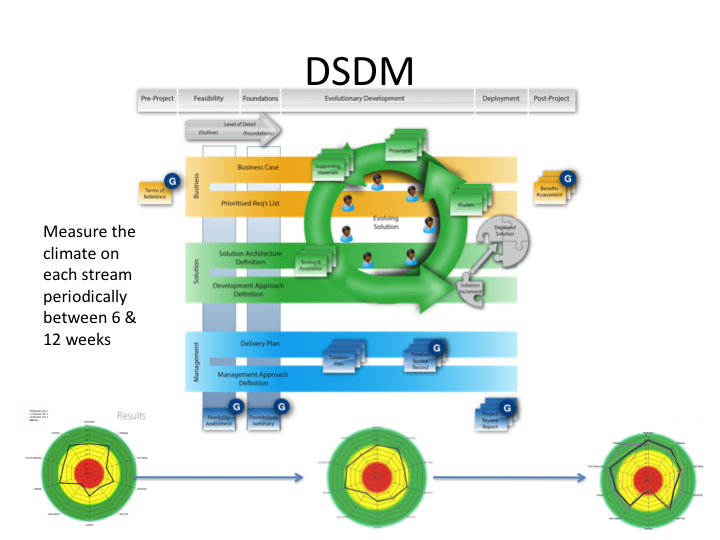

# Integration

Climate an be integrated with all standard processes.

It is important to know that change in human behaviour takes about six weeks.[1](#myfootnote1),[2](#myfootnote2)

Agile methods are common. They have changed over time. Are they still fit for purpose? Do they provide a competitive advantage?

### Scrum & Scrumban

Scrum is the start point for most agile implementations. It was useful for small teams who were working with new technologies. It is common for estimation to be performed in relative terms. Stories are prioritised on what the user, or their proxy, specifies. Be aware that as Henry Ford said - "If I asked them what they wanted they would say 'Faster horses'"

Estimation is done using complexity. Complexity is just a way if saying "I am not too sure of what I am doing - but I have some strategies and experiments to help figure things out" In short it is a learning metric: converting complexity to delivered is applied learning. There is value to both individuals, teams, organisation and customer.

Scrum teams are given six weeks to find their cadence. Rest assured what they currently deliver in months AI will deliver in minutes...Just when this happens will be a result of investor pressure. It will not be a self-organising decision.

### Kanban

Let's all pretend we are making white goods on a production line. Determine the Work In Progress limits (WIP) and set the limits of how much work is allowed in each part of the process.

##### Climate can be applied to Kanban processes at reqular periods.

## Scaled Agile
As agile became accepted by businesses several scaled methods appeared. Some are proprietary and some are in-house

### SAFe
Scaled Agile is __very__ proscriptive. It is a set of rules that appear to work for the types of organisation that are more soap opera than dynamic doers.

Climate can be measured by the implementation team during the initialisation phase

Climate can be measured at the start and end of each Program Increment [PI]

### LeSS
LeSS is more of an orgainsational development [OD] framework. It has many good features on paper that appear intuitive - but is has it put the cart on front of the horse? Dows it make sense to structure an organisation around the Information Technology.

As climate can be applied at any BAFort Level it is very useful to track Form, Storm, Norm, Perform status - if that is your considered way of measurement.

### Disciplined Agile Delivery (DaD)
DaD is driven by the tech teams. It reminds me of the stories of prog rock bands in the studio taking days to emulate a bass guitar with a ruler and elastic band - when they had a perfectly good bass in the studio.

## DSDM

DSDM is often overlooked by IT teams. That is a shame as it is a good process that takes into account the __real__ business needs first.

## Waterfall
Waterfall projects are more suited to business projects than IT. They were used in construction and adopted. Level 2 layers of Analyse, Design, Build, Test, Deliver have been superseded by agile IT methods. There is still a place for these types of project when developing something that is novel and has new ways of work that are not solely IT focussed.

Climate can be measured at the start and end of each phase. The differences can be included as part of the after action review. [AAR]

## Lean Scenes
Lean Scenes are a new way of work. They put people first, reflecting role based jobs as agile is supposed to. Something got lost when Agile went mainstream. That something is invariably the customer.

Lean Scenes are the starting point to make experiments to improve the climate. Improving the climate usually has knock on effects in terms of productivity, efficiency and morale.[3](#myfootnote3)

## Agile

Marginal gains can be scaled across the teams. It is low risk and compatible with the above methods.

#### Foot notes
<a name="myfootnote1">1</a>: Dr Norman Doidge <a href="https://www.amazon.co.uk/Brains-Way-Healing-Remarkable-Discoveries-ebook/dp/B00NUMV1J4/ref=sr_1_1?ie=UTF8&qid=1546007698&sr=8-1&keywords=how+the+brain+heals" target="_blank">The Brain's way of healing</a>

<a name="myfootnote2">2</a>: Bessel Van Der Kolk <a href="https://www.amazon.co.uk/Body-Keeps-Score-Transformation-Trauma-ebook/dp/B00IICN1F8/ref=sr_1_1?s=digital-text&ie=UTF8&qid=1546007758&sr=1-1&keywords=van+der+kolk" target="_blank">The Body Keeps the Score</a>

<a name="myfootnote3">3</a>: Burnett & Moore <a href="https://www.amazon.co.uk/Creative-Climate-Change-innovation-facilitators-ebook/dp/B00MDH1SLS target="_blank">Creative Climate Change</a>