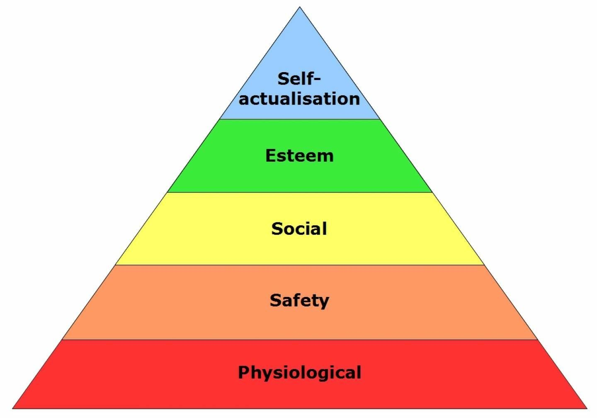
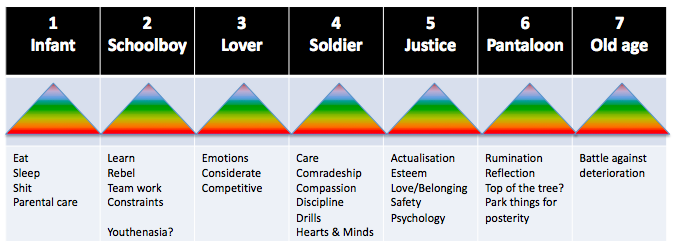

# (m)As you like it

In the play "As you like it" Shakespeare informed us that "All the world's a stage". The soliloquy subsequently runs through the seven ages of man[1](#myfootnote1).

Today it feels that "All the world's a screen". Life is more akin to a fast-paced, jump-cut movie than a slow, linear play. It is easy to get confused, overwhelmed or lost.

Abraham Maslow[2](#myfootnote2) the psychologist has an eponymous model that lists a hierarchy of needs.

<!--  -->

It is recognised that Maslow's taxonomy of his hierarchy applies to middle aged white men. The ontology is useful so we can all make our own taxonomy to know what we need and want.

Mashing Shakespeare's breadth and Maslow's depth lets us stand on their shoulders. It provides for a better understanding of our changing needs as we move along the mortal coil.

Here is one I made earlier.

I am, like Maslow, a middle aged white male. I have added in what I recall as the predominant brain wave types for the stations in life that I have passed - and what I anticipate will come. Will I go gently or rage, rage against the dying of the light[3](#myfootnote3)  or perhaps wear purple[4](#myfootnote4) before the final act.

Until then I can activate the brain waves that I want when I need them, and appreciate that others are using the most relevant ones for where they are at. I do not try imposing Pantaloon thinking on lovers and soldiers.

## Benefits
1. Knowledge of self in context is important.
2. Knowing where you want to go helps plan for the troughs between the peaks.
3. Being able to activate different wave types is useful for healing.
4. Keep yourself sane in a mad world. If only Kipling knew this...

It you want to roll your own version <a href="https://comscientia.com/blocs/_blog/downloads/mas-you-like-it.pptx">download this PowerPoint template</a> and fill in what is relevant to you.

#### Foot notes
<a name="myfootnote1">1</a>: Soliloquy <a href="https://www.poets.org/poetsorg/poem/you-it-act-ii-scene-vii-all-worlds-stage" target="_blank">Seven Ages </a>

<a name="myfootnote2">2</a>: Ivan Maslow on <a href="https://en.wikipedia.org/wiki/Abraham_Maslow" target="_blank">wikipedia</a>

<a name="myfootnote3">3</a>: Dylan Thomas reads <a href="https://www.youtube.com/watch?v=1mRec3VbH3w" target="_blank">Do not go gentle into that good night</a>

<a name="myfootnote4">4</a>: Jenny Joseph reads <a href="https://www.youtube.com/watch?v=8cACbzanitg" target="_blank">Warning</a>