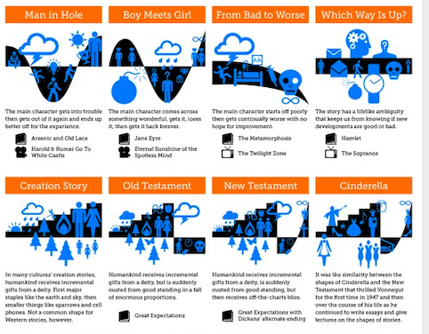

# Narrative Arcs

Kurt Vonnegut identified eight (8) story lines classified below.

The shapes of the story-lines are very similar to projects. The top four remind me of waterfall and the bottom four are like agile.

The only story that ends on time is the creation one and that is literally a bunch of myths. At best your work is a "Which way is Up?" story. A Soap Opera with predictable plot lines and characters that change so so slowly.

Sometimes we are lucky to get gigs that are life affirming. They usually engage us by way of identifying the scary thing in the forest and then beating it in a battle.

It is time to better understand work in order to model and perform it properly. if you will excuse the split infinitive we are Human biographical beings. We make our own stories and dramas to justify our actions and excuse our mistakes.

We offer you the techniques and tools to write your work based story, select the soundtrack and convert it into business cases that justify your tactical advance to battle.