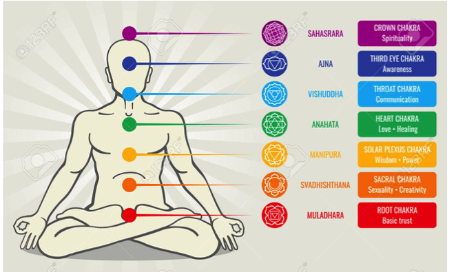

# Polyvagal Theory

Our brains are supported by our bodies.

It has long been known but never fully understood.

Stephen Porges[1](#myfootnote1)  has produced polyvalgal theory[2](#myfootnote2)  to explain it a bit better

I find that polyvagalism explains the way we act in more social terms than chakras.

If you prefer chakras stick with it.

### Notes

<a name="myfootnote1">1</a>: Stephen Porges <a href="https://www.youtube.com/watch?v=ec3AUMDjtKQ" target="_blank">Flow</a>

<a name="myfootnote2">2</a>: Polyvagal theory <a href="https://ct.counseling.org/2016/06/polyvagal-theory-practice/" target="_blank">Flow</a>