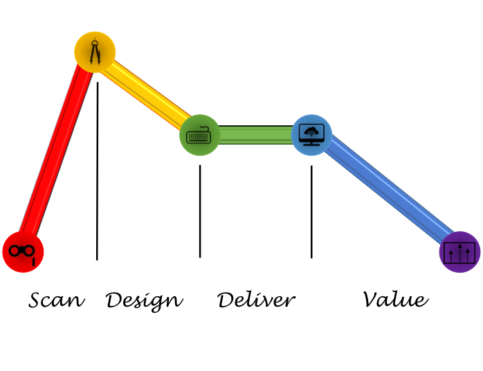

# SDDV Linear

Scan Design Deliver Value

Value driven design starts from the Scan. 

Scan using opera glasses. They provide the correct level of magnification for work.

Design using critical, creative and commercial thinking

Delivery will become more time boxed as machines automate the development process.

Value will fall over time.

A word about time-scales. There are three (3) distinct time zones:

Scan and Design are done first. This is composition time.

Delivery is what you perform. In human software development this is weeks. Machines will make it minutes. Just how it will happen is to be seen - but happen it will.

Value can be considered at least 5 ways: Customer, Strategic, Operations, Team and personal. It is best to start with personal value. Once you realise that your work provides it you will be better motivated to achieve the other value elements.