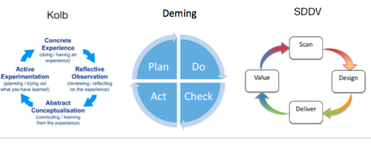
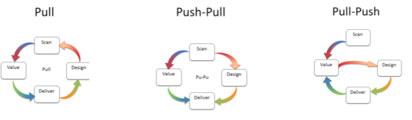

# SALVe Process

Learning is the key capability for survival. Learning has changed and is continuing to do so.

I propose that a value based cycle is relevant for knowledge work. It is not a great leap.

Kolb is academic and Deming's model is prevalent in agile and production line systems. The foundation learning cycles are clockwise in nature.

It is time to break with that convention. (Tenet #1 - Adopt a set to break a set)

SDDV changes the abstract flow of work to better reflect reality. Learning can be applied in different ways. Music theorists will spot the similarities to descending scales, contrapuntal tunes and motifs.

It is important to appreciate the direction of thought while playing to a rhythm. The perception that we have of work is that we are composing BUT others think we are playing like session musicians...

The underlying learning cycles are tacitly used. The logos of growth as a continuously rising metric is incorrect. Work should incorporate ethos and pathos. These are prevalent in music. There are lessons to be lifted and applied.

